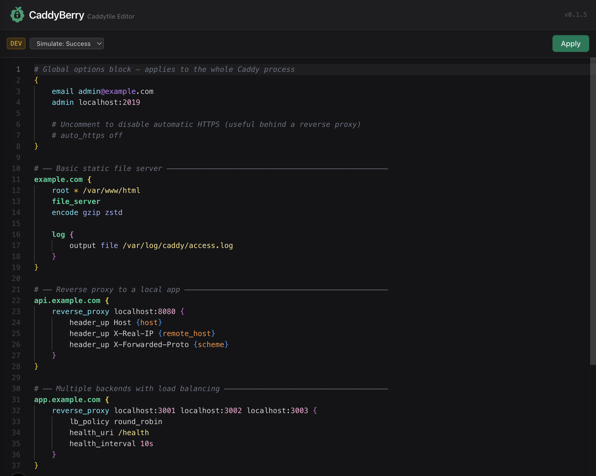

# CaddyBerry

[](https://github.com/StelianMorariu/CaddyBerry/pkgs/container/caddyberry) [](https://github.com/StelianMorariu/CaddyBerry/tags)

A web-based editor for [Caddy](https://caddyserver.com) configuration files.



## What it does

Provides a browser-based Monaco editor (the same editor that powers VS Code) for editing your Caddyfile, with:

- **Syntax highlighting** — directives, matchers, addresses, variables, paths, and more, all colour-coded
- **Validate & apply** — on save, the config is validated against the Caddy admin API before being written to disk and reloaded live, so a bad config can never take your server down
- **TLS health check** — after every reload, CaddyBerry probes the TLS handshake on a configured endpoint; if the TLS cache is corrupted it automatically restarts the Caddy container and polls until it recovers, surfacing a persistent error banner if recovery fails
- **Keyboard shortcut** — `Ctrl`/`Cmd` + `S` to apply
- **Mobile friendly** — readable and usable on small screens

> **Security note:** CaddyBerry has no built-in authentication. Anyone who can reach the app can read and modify your Caddyfile. Run it on a private network or behind a reverse proxy with authentication (e.g. Caddy `basicauth`, Authelia, oauth2-proxy).

## Usage

### Docker Compose

```yaml
services:
  caddyberry:
    image: ghcr.io/stelianmorariu/caddyberry:latest
    ports:
      - "3000:3000"
    environment:
      CADDYFILE_PATH: /config/Caddyfile
      CADDY_ADMIN_URL: http://caddy:2019
      # Optional: enable TLS health checks and auto-restart after reload
      # CADDY_TLS_CHECK_IP: 192.168.1.10       # IP or hostname to probe on port 443
      # CADDY_TLS_CHECK_HOST: my.domain.example # Host header / SNI for the probe
      # CADDY_CONTAINER_NAME: caddy             # Container to restart (default: caddy)
    volumes:
      - ./Caddyfile:/config/Caddyfile
      # Required if using TLS health checks + auto-restart:
      # - /var/run/docker.sock:/var/run/docker.sock
    restart: unless-stopped
```

`caddyberry` needs to share the same Caddyfile that Caddy reads on startup, and network access to the Caddy admin API (port `2019` by default).

## Environment variables

| Variable | Default | Description |
|---|---|---|
| `CADDYFILE_PATH` | `/caddy/Caddyfile` | Path to the Caddyfile on disk |
| `CADDY_ADMIN_URL` | `http://caddy:2019` | Base URL of the Caddy admin API |
| `CADDY_TLS_CHECK_IP` | `caddy` | IP or hostname to connect to on port 443 for the TLS probe |
| `CADDY_TLS_CHECK_HOST` | — | Host header / SNI used by the TLS probe; **if unset, TLS checking is disabled** |
| `CADDY_CONTAINER_NAME` | `caddy` | Docker container name to restart when TLS corruption is detected |
| `IS_DEV` | — | Set to `true` to skip all network requests and use built-in sample content instead |

### TLS health check

Caddy can silently corrupt its TLS cache after a hot reload, causing all HTTPS proxies to return a TLS handshake error while Caddy itself reports success. CaddyBerry detects this automatically:

1. After every successful reload, it opens a TLS connection to `CADDY_TLS_CHECK_IP:443` with the configured `Host` header
2. If the handshake fails, it restarts the Caddy container via the Docker socket and polls for up to 10 seconds
3. On recovery, a success toast is shown; if recovery fails, a persistent error banner prompts you to restart manually

To enable this feature you must set `CADDY_TLS_CHECK_HOST` and mount the Docker socket into the CaddyBerry container. The Docker socket grants container-level restart privileges — this is a common and accepted trade-off in homelab setups, but be aware of the security implications.

## Local development

Create a `.env` file in the project root:

```bash
# Use built-in sample data — no running Caddy instance needed
IS_DEV=true

# Or point at a real Caddy instance
# CADDYFILE_PATH=/path/to/your/Caddyfile
# CADDY_ADMIN_URL=http://localhost:2019
```

Then:

```bash
npm install
npm run dev   # runs on http://localhost:3000
```

With `IS_DEV=true`, the editor loads a built-in sample Caddyfile on startup and mocks the apply pipeline — no running Caddy instance needed. A **DEV** badge appears in the toolbar with a dropdown to simulate success or failure responses.
